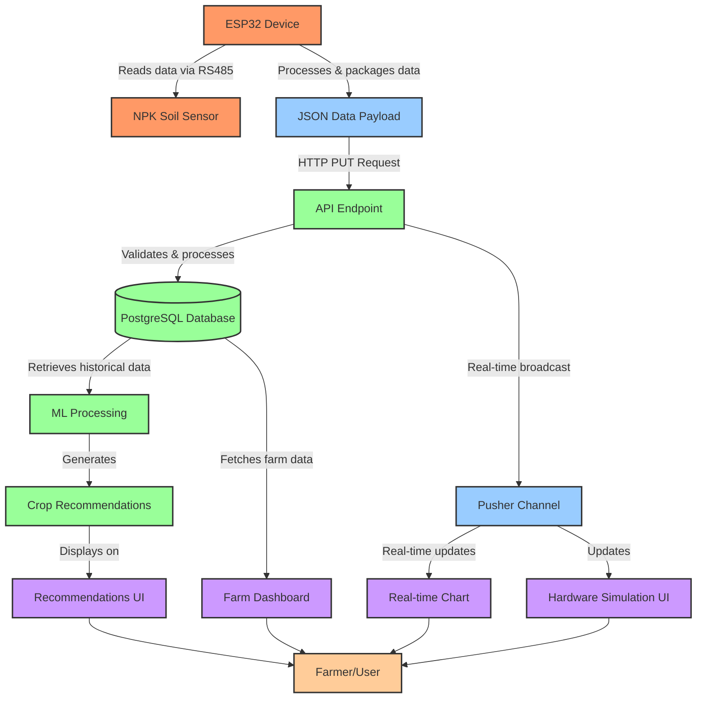

# SoilGuardian System Flow Diagram

## Simplified Data Flow:

1. **Data Collection:**
   ESP32 hardware reads soil data from NPK sensors

2. **Data Transmission:**
   ESP32 sends JSON data to Next.js API endpoint

3. **Data Processing:**

   - Data is stored in PostgreSQL via Prisma
   - Real-time updates sent via Pusher channels
   - ML model generates crop recommendations

4. **Data Visualization:**

   - Real-time charts show current soil conditions
   - Hardware simulation displays device status
   - Dashboard presents farm overview and recommendations

5. **User Interaction:**
   Farmers view data, receive recommendations, and manage farms
